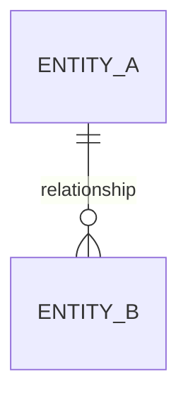

# Architecture Review — {project_name} v{N}

**Version:** v{N} of {N_max} (amend budget: {remaining}/{3} remaining)
**Date:** {ISO 8601 timestamp}
**Source:** {"interview" | "synthesis from imported architecture"}
**Reviewer:** {human name / role}
**Status:** ☐ pending review

---

## Decision at a glance

**Recommended stack:**
- Backend: {choice} — {one-line rationale}
- Frontend: {choice} — {one-line rationale}
- Database: {choice} — {one-line rationale}
- LLM routing: {cloud-only | hybrid | local-only}, primary {model}, failover {chain}
- Deployment: {choice} — {one-line rationale}
- Verification mode: {docker | local | stub}

**Confidence:** {high | medium | low}
**Key risks (top 3):**
1. {risk}
2. {risk}
3. {risk}

---

## 1. Stack decisions

### 1.1 Backend

**Chosen:** {stack}
**Reasoning:** {2-4 sentences citing BRD requirements}
**Alternatives considered:**
- {alt 1} — rejected because {reason}
- {alt 2} — rejected because {reason}
**References from learnings:** {list `.claude/learnings/stack-decisions/*.md` entries consulted}

### 1.2 Database

Same structure.

### 1.3 Frontend

Same structure.

### 1.4 LLM routing

**Strategy:** {cloud-only | hybrid | local-only}
**Reasoning agents:** {model} ({cost estimate/1M})
**Code-gen agents:** {model} ({cost estimate/1M})
**Failover chain:** {ordered list}
**Reasoning:** {2-4 sentences}

### 1.5 Deployment

Same structure.

### 1.6 Verification mode

**Mode:** {docker | local | stub}
**dev_bootstrap:** {command}
**dev_teardown:** {command}
**Reasoning:** {1-2 sentences}

---

## 2. AI-native pillars (conditional — only if BRD requires)

Include ONE of the following, based on BRD content:

### 2.a Agentic architecture (if BRD describes agents)

- Agent count and roles
- Protocols (MCP, A2A)
- Communication pattern (star, mesh, hierarchical)
- Framework choice
- Human oversight model (which decisions require HITL)

### 2.b AI/ML pipeline (if BRD involves ML)

- Models (training vs inference)
- Batch vs real-time
- RAG components (retriever, index, embedding model)
- Vector DB choice
- Monitoring approach

### 2.c Governance & compliance (if BRD involves user data or AI decisions)

- Regulations in scope (GDPR / HIPAA / SOC2 / EU AI Act / other)
- PII handling approach
- Fairness requirements
- Audit trail approach

---

## 3. Data model (top-level)

Entities, relationships, and where they live. Mermaid ERD encouraged.



---

## 4. Component map (top-level)

Which module owns what. Cite the story → file mapping approach.

| Component | Responsibility | Consumes | Produces |
|---|---|---|---|
| ... | ... | ... | ... |

---

## 5. Alternatives considered (system-level)

Approaches evaluated at the whole-system level before decomposing into per-decision alternatives:

1. **{Approach A}** — {description}. Rejected because {reason}.
2. **{Approach B}** — {description}. Rejected because {reason}.
3. **{Approach C — chosen}** — {description}. Selected because {reason}.

---

## 6. Risks and mitigations

| Risk | Impact | Likelihood | Mitigation |
|---|---|---|---|
| ... | ... | ... | ... |

### 6.1 Balanced Coupling check (BRD v3.2.5)

For each significant inter-component coupling in the design above, apply the 3-axis rule from [`.claude/skills/critic/references/balanced-coupling.md`](../../critic/references/balanced-coupling.md):

```
BALANCE = (STRENGTH XOR DISTANCE) OR (NOT VOLATILITY)
```

| # | A → B | STRENGTH | DISTANCE | VOLATILITY | BALANCE | Notes |
|---|---|---|---|---|---|---|
| 1 | ... | intimate/weak | same-module/same-service/cross-service | high/low | ✓ or ✗ | ... |

Flag any BALANCE=✗ with a mitigation in section 6 above. Worst-case (intimate × cross-service × high volatility) is a design-review blocker.

---

## 7. Open questions

Items where the architect wants confirmation from the human but couldn't get without more BRD detail:

1. {question}
2. {question}

If the human answers these inline in an amend cycle, incorporate the answers into v{N+1}.

---

## 8. Amendment history (v2+)

For v2 and later versions of this review, list what changed from the prior version:

- **v2 (2026-06-11):** amended {section} because {feedback}
- **v3 (2026-06-11):** amended {section} because {feedback}

---

## 9. Human decision (please fill)

☐ **Approve** — write final `specs/design/architecture.md`, generate derived artifacts, set `state/architecture-approved.flag`. `/auto` will be suggested on next SessionStart.

☐ **Amend** — describe changes below. Architect will produce v{N+1} for re-review. Max 3 amend cycles; on the 4th an amendment cycle forces **Restart**.

```
{human's inline amendments here}
```

☐ **Restart** — drop synthesized/interview output, fall back to full 11-round interview from scratch. v{N} is archived to `specs/design/amendments/`.
